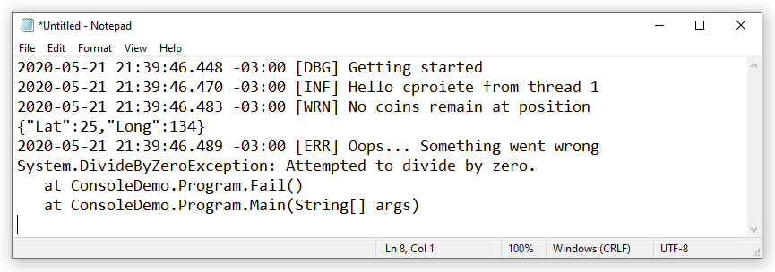
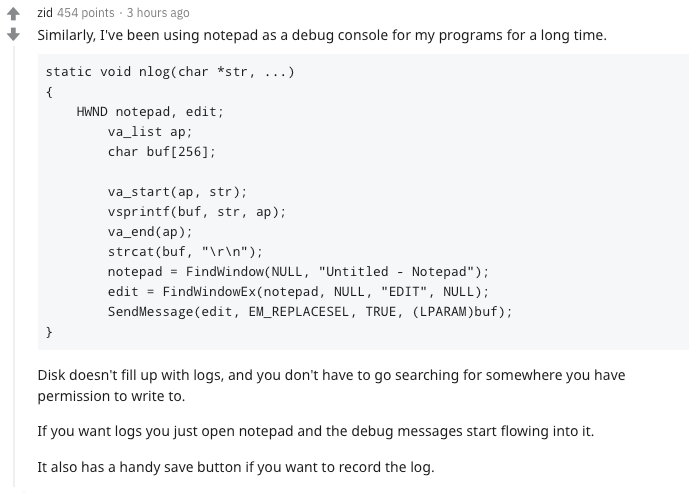

# Serilog.Sinks.Notepad [](https://www.nuget.org/packages/Serilog.Sinks.Notepad) [](http://stackoverflow.com/questions/tagged/serilog)

A [Serilog](https://serilog.net) sink that writes log events to Notepad (_Yes, you've read it right!_). Simply open Notepad and immediately start receiving logs from your application, without even touching the filesystem.



`Serilog.Sinks.Notepad` writes messages to the most recent `notepad.exe` started on current user's session, by default. This behavior can be changed in the sink configuration.

The default output is plain text; JSON formatting can be plugged in using a package such as [_Serilog.Formatting.Compact_](https://github.com/serilog/serilog-formatting-compact).

## Give a Star! :star:

If you like or are using this project please give it a star. Thanks!

## Getting started

Install the [Serilog.Sinks.Notepad](https://www.nuget.org/packages/Serilog.Sinks.Notepad) package from NuGet:

```powershell
Install-Package Serilog.Sinks.Notepad
```

To configure the sink in C# code, call `WriteTo.Notepad()` during logger configuration:

```csharp
Log.Logger = new LoggerConfiguration()
    .WriteTo.Notepad()
    .CreateLogger();

Log.Information("Hello, world!");

Log.CloseAndFlush();
```

Open Notepad, and you should see the logs appear in that Notepad window you've just opened. By default, `Serilog.Sinks.Notepad` writes messages to the most recent `notepad.exe` started by the user. This behavior can be changed in the sink configuration.

## Background

I created this sink just for fun, after reading [this comment on Reddit](https://www.reddit.com/r/programming/comments/gnazif/ray_tracing_in_notepadexe_at_30_fps/fr8uy2l/):

[](https://www.reddit.com/r/programming/comments/gnazif/ray_tracing_in_notepadexe_at_30_fps/fr8uy2l/)

I thought it was a clever idea to be able to simply open a Notepad instance and immediately start receiving logs from your application, and I can imagine this actually being useful for troubleshooting issues with applications.

## Configuration

### Output templates

The format of events written to Notepad can be modified using the `outputTemplate` configuration parameter:

```csharp
    .WriteTo.Notepad(
        outputTemplate: "[{Timestamp:HH:mm:ss} {Level:u3}] {Message:lj}{NewLine}{Exception}")
```

The default template, shown in the example above, uses built-in properties like `Timestamp` and `Level`. Properties from events, including those attached using [enrichers](https://github.com/serilog/serilog/wiki/Enrichment), can also appear in the output template.

### JSON output

The sink can write JSON  output instead of plain text. `CompactJsonFormatter` or `RenderedCompactJsonFormatter` from [Serilog.Formatting.Compact](https://github.com/serilog/serilog-formatting-compact) is recommended:

```powershell
Install-Package Serilog.Formatting.Compact
```

Pass a formatter to the `Notepad()` configuration method:

```csharp
    .WriteTo.Notepad(new RenderedCompactJsonFormatter())
```

Output theming is not available when custom formatters are used.

### XML `<appSettings>` configuration

To use the Notepad sink with the [Serilog.Settings.AppSettings](https://github.com/serilog/serilog-settings-appsettings) package, first install that package if you haven't already done so:

```powershell
Install-Package Serilog.Settings.AppSettings
```

Instead of configuring the logger in code, call `ReadFrom.AppSettings()`:

```csharp
Log.Logger = new LoggerConfiguration()
    .ReadFrom.AppSettings()
    .CreateLogger();
```

In your application's `App.config` or `Web.config` file, specify the Notepad sink assembly under the `<appSettings>` node:

```xml
<configuration>
  <appSettings>
    <add key="serilog:using:Notepad" value="Serilog.Sinks.Notepad" />
    <add key="serilog:write-to:Notepad" />
```

To configure the Notepad sink and include the `SourceContext` in the output, change your `App.config`/`Web.config` to:
```xml
<configuration>
  <appSettings>
    <add key="serilog:using:Notepad" value="Serilog.Sinks.Notepad" />
    <add key="serilog:write-to:Notepad.outputTemplate" value="[{Timestamp:HH:mm:ss} {Level:u3}] {Message:lj} &lt;s:{SourceContext}&gt;{NewLine}{Exception}" />
```

### JSON `appsettings.json` configuration

To use the Notepad sink with _Microsoft.Extensions.Configuration_, for example with ASP.NET Core or .NET Core, use the [Serilog.Settings.Configuration](https://github.com/serilog/serilog-settings-configuration) package. First install that package if you have not already done so:

```powershell
Install-Package Serilog.Settings.Configuration
```

Instead of configuring the sink directly in code, call `ReadFrom.Configuration()`:

```csharp
var configuration = new ConfigurationBuilder()
    .AddJsonFile("appsettings.json")
    .Build();

Log.Logger = new LoggerConfiguration()
    .ReadFrom.Configuration(configuration)
    .CreateLogger();
```

In your `appsettings.json` file, under the `Serilog` node, :
```json
{
  "Serilog": {
    "WriteTo": [{"Name": "Notepad"}]
  }
}
```

To configure the Notepad sink and include the `SourceContext` in the output, change your `appsettings.json` to:
```json
{
  "Serilog": {
    "WriteTo": [
      {
        "Name": "Notepad",
        "Args": {
          "outputTemplate": "[{Timestamp:HH:mm:ss} {Level:u3}] {Message:lj} <s:{SourceContext}>{NewLine}{Exception}"
        }
      }
    ]
  }
}
```

## Release History

Click on the [Releases](https://github.com/augustoproiete/serilog-sinks-notepad/releases) tab on GitHub.

---

_Copyright &copy; 2020 C. Augusto Proiete & Contributors - Provided under the [Apache License, Version 2.0](http://apache.org/licenses/LICENSE-2.0.html)._
